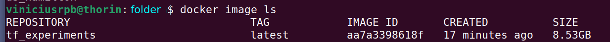

# Executando experimentos com o Docker, Tensorflow-GPU

Todos os passos abaixo foram realizados no Linux.

## Instalação do Docker

Siga as instruções exatamente como consta [aqui](https://docs.docker.com/engine/install/ubuntu/).

Em seguida, com o usuário administrador (root), adicione o seu nome de usuário para permitir que você roder os comandos docker sem o ```sudo```:

```
sudo groupadd docker
sudo usermod -aG docker $USER
```

Faça o login no novo grupo do docker para evitar de ter que logar/deslogar novamente:

```
newgrp docker
```

Verifique se o docker pode ser executado sem ser pelo usuário ```root```:

```
docker run hello-world
```

## Comandos básicos do Docker

Verificar todas as imagens existentes no Docker:

```
docker image ls
```

Verificar todos os containers existentes no Docker:

```
docker container ls
```

Para verificar o espaço utilizado em disco das imagens, dos containers e da cache, digite no Terminal do Linux:

```
docker system df
```

Para fazer a limpeza apenas da cache (build do Docker):

```
docker builder prune
```

Para fazer a limpeza do espaço em memória ocioso (imagens, containers e cache inutilizadas), digite:

```
docker system prune
```

## Estratégia 1: Copiar todos os fontes e dados para o Container Docker

Nesta estratégia, colocamos todos os arquivos de um projeto que se deseja executar experimentos, fazemos a cópia de todos para o container Docker, em uma pasta chamada ```app/```. Depois, especificamos dentro do Dockerfile o comando para execução dos experimentos no container. Após a execução dos experimentos, deve-se recuperar os arquivos na pasta ```app/```.

### Criando o Dockerfile

Prepare um arquivo denominado "Dockerfile" em um editor de texto de sua preferência, sem formato e exatamente com esse nome, com o seguinte conteúdo:

```
FROM tensorflow/tensorflow:latest-gpu

RUN mkdir /app

WORKDIR /app

COPY . /app

RUN pip3 install --upgrade pip

RUN pip3 install pandas

RUN pip3 install scikit-learn

RUN pip3 install matplotlib

RUN pip3 install transformer

RUN pip3 install opencv-contrib-python

RUN pip3 install keras-tuner
```

Observe que há uma atualização da versão do Python dentro do container Docker. Esse Dockerfile já emprega uma imagem de base do tensorflow com suporte para GPU. O arquivo ``arquivo.py'' é o arquivo Python a ser executado, e que deve ter os experimentos.

Deixe o Dockerfile dentro da pasta em que você quer rodar os experimentos. Em seguida, é hora de fazer o build da imagem. No Terminal do Linux, digite:

```
docker build --file Dockerfile_name -t NOME_CONTAINER . 
```

em que ```Dockerfile_name``` é o nome do arquivo do Dockerfile.

Digite o comando



Finalmente, para rodar o container Docker em modo *foreground*, utilize o comando:

```
docker run -it --rm -v $PWD:/tmp -w /tmp NOME_CONTAINER:TAG python ./script.py
```

Na imagem acima, ```NOME_CONTAINER:TAG``` corresponde a ```tf_experiments:latest```.

Caso queira rodar o container Docker em modo *background*, utilize o comando:

```
docker run -d -it --rm -v $PWD:/tmp -w /tmp NOME_CONTAINER:TAG python ./script.py
```

## Estratégia 2: Rodando python script for fora da imagem

Essa estratégia é vantajosa por não ter que criar uma nova imagem cada vez que um experimento diferente ter de ser executado.

### Criando o Dockerfile

Prepare um arquivo denominado "Dockerfile" em um editor de texto de sua preferência, sem formato e exatamente com esse nome, com o seguinte conteúdo:

```
FROM tensorflow/tensorflow:latest-gpu

# baixar o arquivo da versao Python 3.10

RUN apt update

RUN apt install -y libssl-dev libncurses5-dev libsqlite3-dev libreadline-dev libtk8.6 libgdm-dev libdb4o-cil-dev libpcap-dev

RUN apt install -y wget

RUN apt purge --auto-remove python

RUN wget https://www.python.org/ftp/python/3.10.2/Python-3.10.2.tgz && \
    tar -xzf Python-3.10.2.tgz && \
    cd Python-3.10.2 && \
    ./configure --enable-optimizations && \
    make install

RUN apt install -y python3-pip

# instalacao das APIs para deep learning

RUN mkdir /app

WORKDIR /app

COPY . /app

RUN pip3 install --upgrade pip

RUN pip3 install pandas

RUN pip3 install scikit-learn

RUN pip3 install opencv-python

RUN pip3 install opencv-python-headless

RUN pip3 install matplotlib

RUN pip3 install pandas

RUN pip3 install -U tensorflow

RUN pip3 install tensorflow_addons

RUN pip3 install keras-tuner

CMD [ "python3", "arquivo.py"]
```

Observe que há uma atualização da versão do Python dentro do container Docker. Esse Dockerfile já emprega uma imagem de base do tensorflow com suporte para GPU. O arquivo ``arquivo.py'' é o arquivo Python a ser executado, e que deve ter os experimentos.

Deixe o Dockerfile dentro da pasta em que você quer rodar os experimentos. Em seguida, é hora de fazer o build da imagem. No Terminal do Linux, digite:

```
docker build -t NOME_CONTAINER .
```

Digite o comando


Caso necessite copiar os dados (em arquivo único ou como uma pasta), execute o comando:

```
docker cp src_path container:dest_path
```

Finalmente, para rodar o container Docker em modo *foreground*, utilize o comando:


```
docker run -it --rm --name tf_single_script -v "$PWD":/usr/src/app -w /usr/src/app NOME_CONTAINER:TAG python script.py
```

Caso queira rodar o container Docker em modo *background*, utilize o comando:

```
docker run -d NOME_CONTAINER:TAG
```


